## Ushbu topshiriq ikkita vazifani o'z ichiga oladi. TASK1 va TASK2 ni.
## PART1 
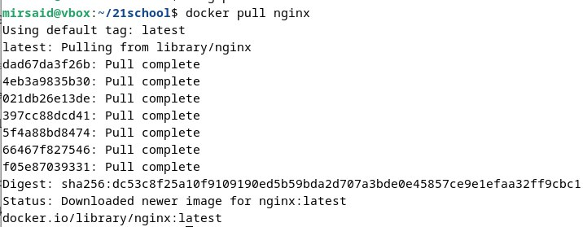
## `docker pull` buyrug'i yordamida docker obrazini yuklab oldim.
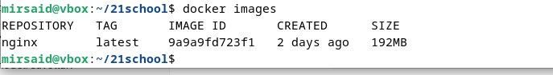
## `docker images` buyrug'i yordamida docker obrazi mavjudligini  tekshirdim.
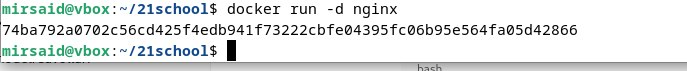
## `docker run -d nginx` buyrug'i yordamida nginx ni ishga tushirdim.
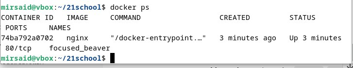
## `docker ps` buyrug'i bilan nginx dagi **74ba792a0702** containerni ishga tushirilganini ko'rdim.
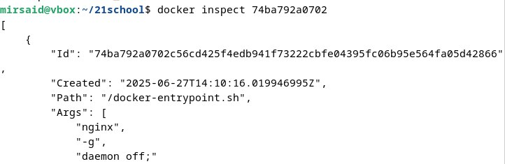
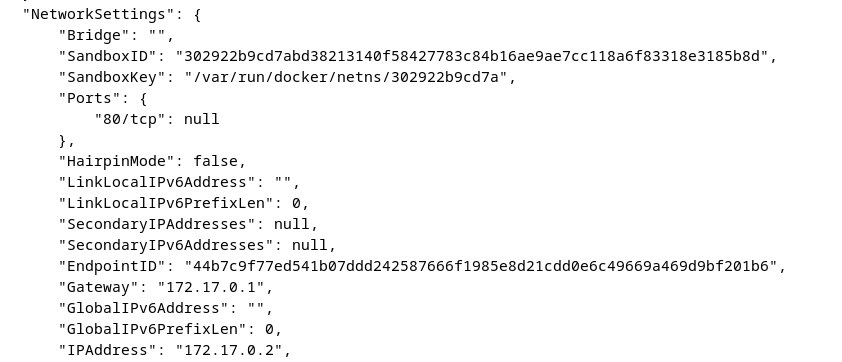
## `docker inspect 74ba792a0702` buyrug'i yordamida container ma'lumotlarini ko'rdim. Network(tarmoq) sozlamalarida 
### port: 80/tcp: null 
### ip address: 172.17.0.2        ma'lumotlari berilgan.

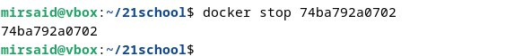
## `docker stop 74ba792a0702` buyrugi bilan docker obrazini to'xtatilgan. 
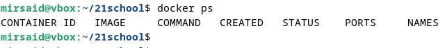
## `docker ps` buyrug'i yordamida yana bir bor docker obrazlarini ishga tushirilgan yoki tushirilmagini tekshirdim.

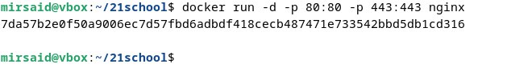
## `docker run -d -p 80:80 -p 443:443 nginx` buyrug'i yordamida maplangan konteynerdagi 80 va 443 portlarga ega dockerni ishga tushiradi.
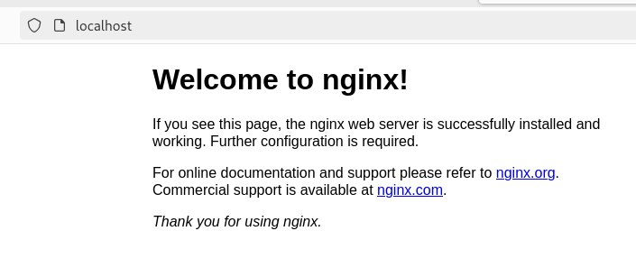
## yuqoridagi portlarni ishlashini tekshirish uchun brauzerga *localhost:80* `https://localhost//:80` ni yozamiz.Ishlaganini oynada Welcome to nginx yozuvi orqali bilamiz.
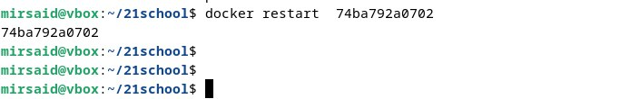
## `docker restart 74ba792a0702` buyrug'i bilan docker obrazni qayta ishga tushirdim.
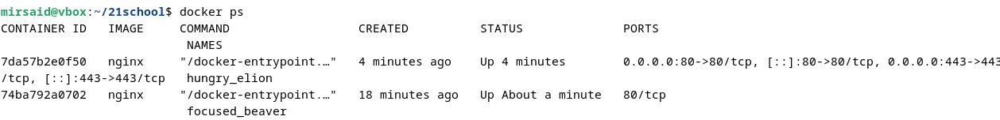
## `docker ps` buyrug'i yordamida container ni ishga tushirilganini tekshirdim.

## PART 2
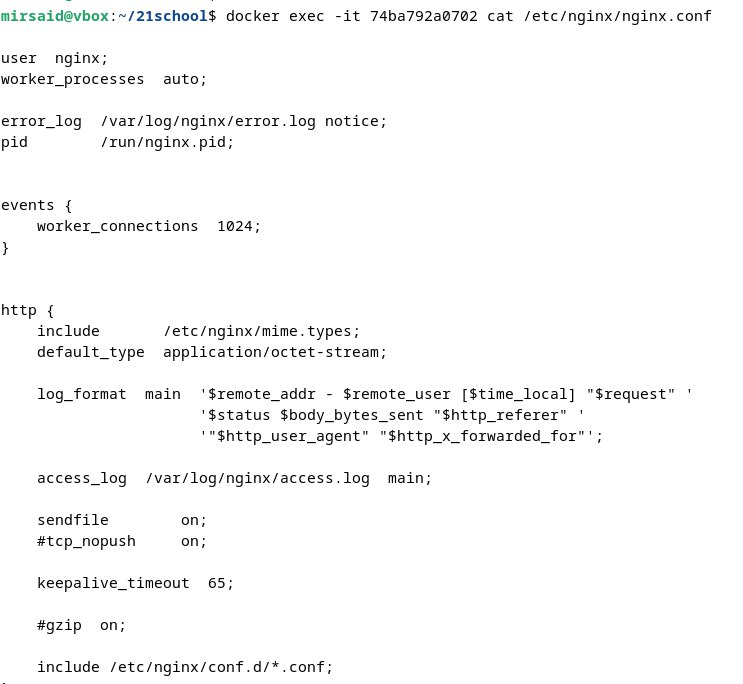
## `docker exec -it 74ba792a0702 cat /etc/nginx/nginx.conf` buyrug'i bilan docker konteyneridagi *nginx.conf* faylini o'qidim.
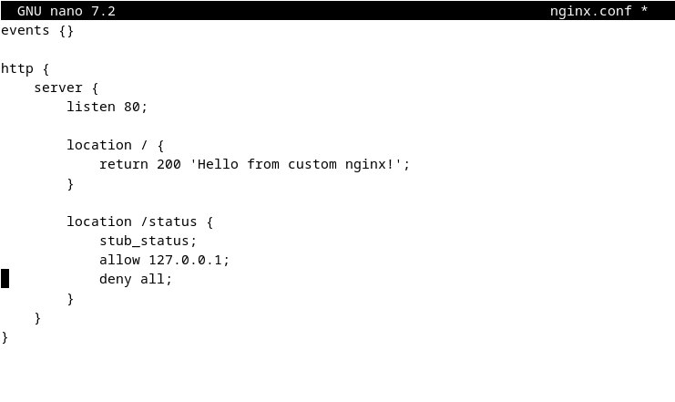
## Bu yerda o'zim yaratgan nginx.conf konfiguratsiya fayli.
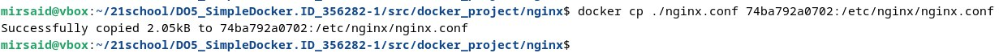
## `docker cp ./nginx.conf 74ba792a0702:/etc/nginx/nginx.conf` buyrug'i bilan konteynerga yukladim.
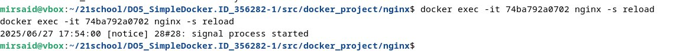
## `docker exec -it 74ba792a0702 nginx -s reload ` buyrug'i bilan konteynerni ishga tushirdim. 

## Brauzer orqali `http://localhost/status` ga kirdim va nginx status sahifasi ko‘rindi.
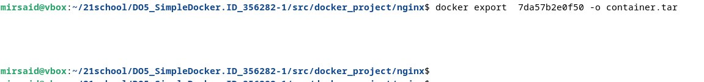 
## `docker export 7da57b2e0f50 -o container.tar` buyrug'i orqali konteynerga export qildim.
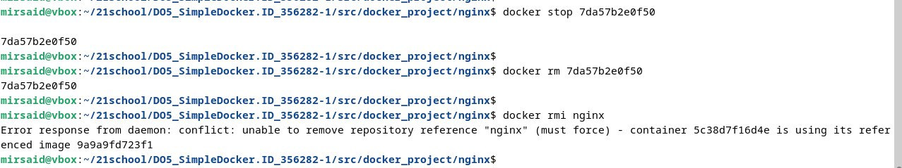 
## `docker stop 7da57b2e0f50` buyrug'i bilan konteyner to'xtatildi hamda ` docker rm 7da57b2e0f50 ` buyrug'i orqali konteyner o'chirildi. `docker rmi nginx ` buyrug'i orqali image o'chirildi.
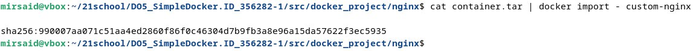
## ` cat container.tar | docker import custom-nginx ` buyrug'i orqali `docker import` orqali eksport qilingan tar fayldan yangi image yaratildi.
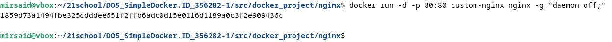 
## `docker  run -d -p 80:80 custom-nginx nginx -g "daemon off;" ` buyrug'i orqali nginx ni qayta ishga tushirdim.
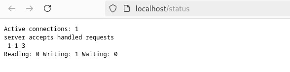
## `http://localhost/status` sahifasida nginx status qayta ko‘rindi.  
